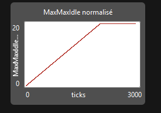
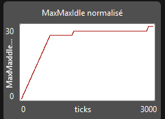
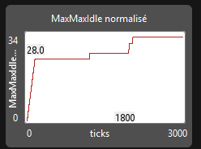
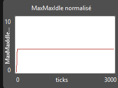
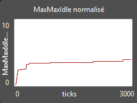
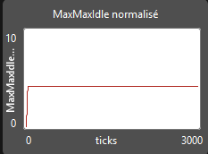

## 4 patrouilleurs, aléatoire

"  
observer> show max-max-idle

observer: 1989

observer> show (count patrouilleurs / count patches) * max-max-idle

observer: 19.89

## 16 patrouilleurs, aléatoire

observer> show max-max-idle
observer: 745
observer> show (count patrouilleurs / count patches) * max-max-idle
observer: 29.8

## 64 patrouilleurs, aléatoire

observer> show max-max-idle
observer: 205
observer> show (count patrouilleurs / count patches) * max-max-idle
observer: 32.8

## 4 patrouilleurs, heuristique

observer> show max-max-idle
observer: 26
observer> show (count patrouilleurs / count patches) * max-max-idle
observer: 4.16

## 16 patrouilleurs, heuristique

observer> show max-max-idle
observer: 97
observer> show (count patrouilleurs / count patches) * max-max-idle
observer: 3.88

## 64 patrouilleurs, heuristique

observer> show max-max-idle
observer: 26
observer> show (count patrouilleurs / count patches) * max-max-idle
observer: 4.16

## Tableau récapitulatif

| Stratégie | Nombre d'agents ($m$) | Facteur ($m/n$) | MaxMaxIdle(G) (brut) | MaxMaxIdle(G) (normalisé) |
| :--- | :---: | :---: | :---: | :---: |
| Aléatoire | 4 | $4 / 400 = 0{,}01$ | 1 989 | 19,89 |
| Aléatoire | 16 | $16 / 400 = 0{,}04$ | 745 | 29,8 |
| Aléatoire | 64 | $64 / 400 = 0{,}16$ | 205 | 32,8 |
| Heuristique | 4 | $4 / 400 = 0{,}01$ | 26 | 4,16 |
| Heuristique | 16 | $16 / 400 = 0{,}04$ | 97 | 3,88 |
| Heuristique | 64 | $64 / 400 = 0{,}16$ | 26 | 4,16 |
