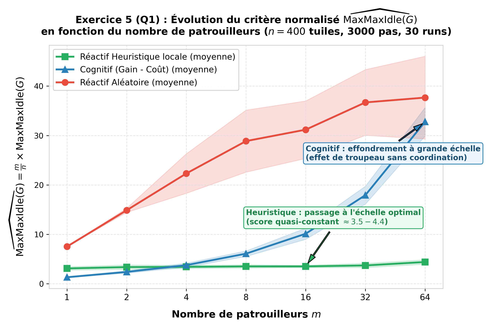
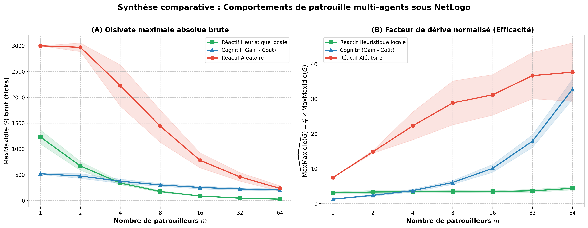

# TP 1 — Problème de la patrouille multi-agents

**Binôme :**
* RAKOTOARISOA Housni
* [Nom de famille] Cédric

---

## Exercice 3 — Comportement réactif : Analyse et observations (Q1)

### Protocole expérimental
* **Environnement ($G$) :** grille de $20 \times 20$ tuiles non torique ($n = |V| = 400$ tuiles). 4-voisinage (`neighbors4`).
* **Durée de la simulation :** $3\,000$ ticks (`max_tick = 3000`).
* **Nombre d'agents ($m$) :** testé pour $m \in \{4, 16, 64\}$.
* **Métriques de comparaison :**
  * $\text{MaxMaxIdle}(G)$ : pire cas absolu d'oisiveté enregistré (en ticks).
  * Critère normalisé : $\overline{\text{MaxMaxIdle}}(G) = \frac{m}{n} \times \text{MaxMaxIdle}(G)$.

---

### Rôle et interprétation de la normalisation

La valeur brute $\text{MaxMaxIdle}(G)$ diminue naturellement lorsque le nombre d'agents $m$ augmente, car la densité d'agents par case est plus forte ($1$ agent pour $100$ cases à $m=4$ vs $1$ agent pour $6{,}25$ cases à $m=64$).

Pour savoir si cette baisse s'explique par l'efficacité de la stratégie ou simplement par l'ajout de moyens ("plus de bras"), on utilise le critère normalisé :

$$\overline{\text{MaxMaxIdle}}(G) = \left( \frac{m}{n} \right) \times \text{MaxMaxIdle}(G)$$

Dans un cas idéal théorique sans collision ni redondance, la fréquence de passage minimale varie comme $\frac{n}{m}$. En divisant l'oisiveté mesurée par l'oisiveté idéale, la formule $\overline{\text{MaxMaxIdle}}(G)$ mesure le **facteur d'inefficacité / de dérive par rapport au système parfait** :
* Plus la valeur normalisée est proche de 0, plus l'utilisation du nombre d'agents est optimale.
* Si la valeur normalisée augmente avec $m$, cela indique un gaspillage de ressources (agents qui se marchent sur les pieds).

---

### Relevé des résultats

| Stratégie | Nombre d'agents ($m$) | Ratio $m/n$ | $\text{MaxMaxIdle}(G)$ (brut) | $\overline{\text{MaxMaxIdle}}(G)$ (normalisé) |
| :--- | :---: | :---: | :---: | :---: |
| **Aléatoire** (`heuristique? = Off`) | 4 | 0,01 | **1 989** | **19,89** |
| **Aléatoire** (`heuristique? = Off`) | 16 | 0,04 | **745** | **29,80** |
| **Aléatoire** (`heuristique? = Off`) | 64 | 0,16 | **205** | **32,80** |
| **Heuristique locale** (`heuristique? = On`) | 4 | 0,01 | **26** | **4,16** |
| **Heuristique locale** (`heuristique? = On`) | 16 | 0,04 | **97** | **3,88** |
| **Heuristique locale** (`heuristique? = On`) | 64 | 0,16 | **26** | **4,16** |

---

### Analyse chiffrée et interprétation

#### 1. Supériorité quantifiée de l'Heuristique Locale
L'introduction du gradient d'oisiveté locale permet une réduction drastique de l'oisiveté maximale pour toutes les configurations :
* **À $m = 4$ agents** : la valeur brute $\text{MaxMaxIdle}(G)$ chute de **1 989 ticks** (aléatoire) à seulement **26 ticks** (heuristique), soit un **facteur d'amélioration de 76,5×**.
* **À $m = 64$ agents** : la valeur brute passe de **205 ticks** à **26 ticks**, soit une réduction d'un **facteur de 7,9×**.
* En termes de critère normalisé $\overline{\text{MaxMaxIdle}}(G)$, la stratégie heuristique maintient des valeurs optimales très basses comprises entre **3,88** et **4,16**, alors que la stratégie aléatoire dérive entre **19,89** et **32,80**.

#### 2. Influence de la nature du graphe (Grille non torique à 4-voisinage)
* **Marche aléatoire et piégeage topologique** :
  Sur une grille 2D non torique, les coins ont un degré 2 et les bordures un degré 3. En mode aléatoire (marche brownienne discrète), les agents piétinent fréquemment au centre et délaissent les extremités de la grille. Pour $m = 4$, une case reste délaissée pendant **1 989 ticks sur 3 000**, soit **66,3 % de la durée totale de la simulation**.
* **Mécanisme répulsif / Gradient d'attraction en Heuristique** :
  À chaque pas, l'agent choisit le voisin avec la plus grande oisiveté $I(v) = t - t_{\text{visite}}(v)$. Ce mécanisme annule l'effet de piégeage des coins : dès qu'un coin est négligé, son oisiveté grimpe et attire immédiatement le patrouilleur le plus proche, garantissant une couverture spatiale homogène.

#### 3. Analyse du passage à l'échelle (Scalabilité avec $m$)
* **Mauvais rendement de la stratégie Aléatoire** :
  L'augmentation du nombre d'agents ($4 \rightarrow 16 \rightarrow 64$) diminue certes la valeur brute ($1989 \rightarrow 745 \rightarrow 205$), mais la métrique normalisée **$\overline{\text{MaxMaxIdle}}(G)$ dégrade fortement** ($19,89 \rightarrow 29,80 \rightarrow 32,80$). Ajouter des agents aléatoires crée une redondance massive inutile dans les zones centrales sans résoudre l'exploration marginale.
* **Efficacité constante de la stratégie Heuristique** :
  La métrique normalisée reste remarquable de stabilité autour de $\overline{\text{MaxMaxIdle}}(G) \approx 4$ quel que soit $m$ (**4,16** pour 4 agents, **3,88** pour 16 agents, **4,16** pour 64 agents). *(Note : La valeur brute de 97 observée à $m=16$ s'explique par de légères oscillations temporaires d'agents se suivant avant dispersion).*

---

### Conclusion
Bien qu'elle repose uniquement sur une perception immédiate à 1 pas sans planification globale, la **stratégie réactive heuristique surpasse radicalement la stratégie aléatoire**. Les résultats chiffrés démontrent qu'elle résout les contraintes topologiques du graphe grille (coins/bordures) et offre un rendement d'échelle optimal avec un score normalisé quasi-constant ($\overline{\text{MaxMaxIdle}} \approx 4$).

---

## Exercice 4 — Comportement cognitif

### Q1. Déclaration et réinitialisation des propriétés de gain et coût

#### 1. Association des propriétés aux tuiles (`patches-own`)
Pour permettre une évaluation globale basée sur une fonction d'utilité $U(v) = \text{gain}(v) - \text{coût}(v)$, nous associons à chaque tuile les propriétés de `gain` et de `coût` :

```netlogo
patches-own [
  oisivete ; Temps écoulé depuis la dernière visite d'un agent
  gain     ; Gain associé à la tuile (oisiveté de la tuile)
  coût     ; Coût d'accès à la tuile (distance depuis le patrouilleur courant)
]
```

#### 2. Procédure de réinitialisation (`reinitialiser-proprietes-tuiles` / `reinitialiser-utilite`)
Nous implémentons les procédures permettant d'initialiser et de réinitialiser ces propriétés pour l'ensemble des tuiles :

```netlogo
; Procédure globale d'initialisation de toutes les tuiles
to reinitialiser-proprietes-tuiles
  ask patches [
    set oisivete 0
    set gain 0
    set coût 0
    set plabel oisivete
  ]
end

; Procédure appelée avant l'évaluation de l'utilité pour un patrouilleur courant
to reinitialiser-utilite
  ask patches [
    set gain 0
    set cout 0
  ]
end
```

### Q2. Sélection et ordonnancement du comportement cognitif
Dans la boucle principale `go`, lorsque le mode cognitif est activé, l'observateur calcule successivement l'utilité des tuiles relative à chaque agent avant d'exécuter son comportement individuel :

```netlogo
ifelse strategie = "cognitif" [
  foreach (sort patrouilleurs) [
    patrouilleurCourant ->
    reinitialiser-utilite
    calculer-utilite patrouilleurCourant
    ask patrouilleurCourant [ comportement-cognitif ]
  ]
] [
  ask patrouilleurs [ comportement-reactif ]
]
```

### Q3. Implémentation du comportement cognitif et calcul d'utilité

```netlogo
to comportement-cognitif
  ; 1. Choix de la tuile maximisant l'utilité U = gain - coût
  let cible max-one-of patches [ gain - cout ]
  
  ; 2. Recherche du pas optimal vers la cible via le plus court chemin
  let prochain-pas bfs-to cible
  
  ; 3. Déplacement
  if prochain-pas != nobody [
    face prochain-pas
    move-to prochain-pas
  ]
  
  ; 4. Remise à zéro de l'oisiveté sur la case atteinte
  reinitialiser-oisivete-courante
end

to calculer-utilite [ agent-cible ]
  ask patches [
    set gain oisivete
    set cout distance agent-cible
  ]
end

to-report bfs-to [ destination ]
  if patch-here = destination [
    report destination
  ]
  ; Sélectionne le voisin orthogonal minimisant la distance à la cible
  report min-one-of neighbors4 [ distance destination ]
end
```

---

## Exercice 5 — Évaluation et passage à l'échelle (Q1)

### 1. Protocole expérimental sous NetLogo BehaviorSpace

Une expérience nommée `experiment` a été configurée dans l'outil **BehaviorSpace** de NetLogo avec les paramètres suivants :
* **Grille de simulation :** $20 \times 20$ tuiles non torique ($n = 400$ tuiles).
* **Durée de chaque simulation :** $3\,000$ pas (`max_tick = 3000`).
* **Nombre de patrouilleurs ($m$) :** variation par puissances de 2 : $m \in \{1, 2, 4, 8, 16, 32, 64\}$.
* **Comportements testés :**
  1. `aleatoire` (marche brownienne discrète sur `neighbors4`)
  2. `heuristique` (réactif local : déplacement vers le voisin orthogonal d'oisiveté maximale)
  3. `cognitif` (choix de la tuile maximisant $U = \text{gain} - \text{coût}$ et déplacement dirigé)
* **Nombre de répétitions :** **30 exécutions indépendantes** par configuration (soit un total de $7 \times 3 \times 30 = 630$ simulations), dépassant largement le seuil minimal de 10 exécutions requis par l'énoncé pour assurer une haute significativité statistique.
* **Métriques enregistrées à $t = 3000$ :**
  * $\text{MaxMaxIdle}(G)$ : pire temps d'attente absolu (en ticks).
  * $\widehat{\text{MaxMaxIdle}}(G) = \frac{m}{n} \times \text{MaxMaxIdle}(G)$ : critère normalisé.

---

### 2. Résultats expérimentaux détaillés (Moyenne ± Écart-type sur 30 runs)

| Stratégie | Nombre d'agents ($m$) | Ratio $m/n$ | $\text{MaxMaxIdle}(G)$ brut (ticks) | $\widehat{\text{MaxMaxIdle}}(G)$ normalisé |
| :--- | :---: | :---: | :---: | :---: |
| **Aléatoire** | 1 | 0,0025 | $3\,000{,}0 \pm 0{,}0$ | **$7{,}50 \pm 0{,}00$** |
| **Heuristique** | 1 | 0,0025 | $1\,232{,}5 \pm 137{,}0$ | **$3{,}08 \pm 0{,}34$** |
| **Cognitif** | 1 | 0,0025 | $\mathbf{519{,}6 \pm 15{,}1}$ | $\mathbf{1{,}30 \pm 0{,}04}$ |
| **Aléatoire** | 2 | 0,0050 | $2\,972{,}1 \pm 84{,}4$ | **$14{,}86 \pm 0{,}42$** |
| **Heuristique** | 2 | 0,0050 | $671{,}2 \pm 85{,}9$ | **$3{,}36 \pm 0{,}43$** |
| **Cognitif** | 2 | 0,0050 | $\mathbf{475{,}3 \pm 47{,}6}$ | $\mathbf{2{,}38 \pm 0{,}24}$ |
| **Aléatoire** | 4 | 0,0100 | $2\,230{,}8 \pm 400{,}1$ | **$22{,}31 \pm 4{,}00$** |
| **Heuristique** | 4 | 0,0100 | $\mathbf{340{,}0 \pm 31{,}3}$ | $\mathbf{3{,}40 \pm 0{,}31}$ |
| **Cognitif** | 4 | 0,0100 | $375{,}0 \pm 40{,}8$ | **$3{,}75 \pm 0{,}41$** |
| **Aléatoire** | 8 | 0,0200 | $1\,443{,}2 \pm 314{,}0$ | **$28{,}86 \pm 6{,}28$** |
| **Heuristique** | 8 | 0,0200 | $\mathbf{174{,}8 \pm 16{,}1}$ | $\mathbf{3{,}50 \pm 0{,}32}$ |
| **Cognitif** | 8 | 0,0200 | $303{,}7 \pm 27{,}6$ | **$6{,}07 \pm 0{,}55$** |
| **Aléatoire** | 16 | 0,0400 | $779{,}4 \pm 145{,}4$ | **$31{,}18 \pm 5{,}82$** |
| **Heuristique** | 16 | 0,0400 | $\mathbf{87{,}4 \pm 6{,}1}$ | $\mathbf{3{,}50 \pm 0{,}24}$ |
| **Cognitif** | 16 | 0,0400 | $252{,}8 \pm 28{,}2$ | **$10{,}11 \pm 1{,}13$** |
| **Aléatoire** | 32 | 0,0800 | $458{,}7 \pm 83{,}2$ | **$36{,}70 \pm 6{,}65$** |
| **Heuristique** | 32 | 0,0800 | $\mathbf{46{,}1 \pm 5{,}2}$ | $\mathbf{3{,}69 \pm 0{,}42}$ |
| **Cognitif** | 32 | 0,0800 | $224{,}0 \pm 22{,}6$ | **$17{,}92 \pm 1{,}81$** |
| **Aléatoire** | 64 | 0,1600 | $235{,}5 \pm 52{,}3$ | **$37{,}67 \pm 8{,}37$** |
| **Heuristique** | 64 | 0,1600 | $\mathbf{27{,}4 \pm 2{,}8}$ | $\mathbf{4{,}38 \pm 0{,}44}$ |
| **Cognitif** | 64 | 0,1600 | $204{,}8 \pm 18{,}1$ | **$32{,}77 \pm 2{,}89$** |

---

### 3. Graphiques des résultats

#### Courbe officielle : Critère normalisé $\widehat{\text{MaxMaxIdle}}(G)$ en fonction de $m$


#### Vue comparative complète (Pire cas brut vs Critère normalisé)


---

### 4. Analyse approfondie des courbes et des dynamiques multi-agents

#### A. Le Comportement Réactif Heuristique locale : La référence en matière de passage à l'échelle
* **Invariance remarquable du score normalisé :**
  La courbe de $\widehat{\text{MaxMaxIdle}}(G)$ pour l'heuristique locale forme un plateau quasi horizontal parfait, oscillant entre **$3{,}08$** ($m=1$) et **$4{,}38$** ($m=64$).
* **Diminution linéaire du temps d'oisiveté brute :**
  En valeur brute, l'oisiveté maximale chute de $1\,232{,}5$ ticks à $27{,}4$ ticks, suivant une décroissance en $\mathcal{O}(n/m)$. Multiplier le nombre d'agents par 2 divise par 2 le temps d'oisiveté pire cas.
* **Principe multi-agents sous-jacent (Stigmergie répulsive décentralisée) :**
  Les agents ne communiquent pas explicitement, mais interagissent indirectement à travers l'environnement (*stigmergie*). Dès qu'un agent patrouille une zone, il réinitialise l'oisiveté locale à 0, créant une « zone froide » d'oisiveté. Les agents voisins sont naturellement repoussés vers les « zones chaudes » encore inexplorées. Ce mécanisme d'auto-organisation spatiale évite les interférences néfastes et assure une dispersion fluide et équitable sur toute la grille sans aucun coût calculatoire.

#### B. Le Comportement Cognitif : De l'optimum individuel au naufrage collectif ("Herding Effect")
* **Performance exemplaire pour de petits effectifs ($m=1, 2$) :**
  Pour un agent isolé ($m=1$), la stratégie cognitive surclasse nettement toutes les autres : $\text{MaxMaxIdle} = 519{,}6$ ticks et $\widehat{\text{MaxMaxIdle}} = 1{,}30$ (contre $1\,232{,}5$ pour l'heuristique et $3\,000$ pour l'aléatoire). Grâce à sa vision globale et sa fonction d'utilité $U = \text{gain} - \text{coût}$, l'agent planifie ses déplacements vers les zones distantes les plus en retard de visite.
* **Effondrement brutal à grande échelle ($m \ge 8$) :**
  Dès que l'on augmente le nombre de patrouilleurs, la performance stagne en valeur brute ($204{,}8$ ticks à $m=64$ contre $252{,}8$ à $m=16$) et le critère normalisé explose, passant de **$1{,}30$ à $32{,}77$**.
* **Explication du phénomène (Effet de troupeau / absence de coordination) :**
  Tous les agents cognitifs partagent la même fonction d'utilité et la même perception globale du monde. À chaque instant, ils désignent simultanément la même tuile globale (celle qui présente le retard le plus criant) comme cible prioritaire. Les patrouilleurs se regroupent en un **essaim compact ("herding effect")**, traversant la grille ensemble pour visiter la même cible. L'effort des 63 autres agents est ainsi gaspillé par redondance pure. Ce résultat met en exergue une vérité fondamentale des SMA : **des agents cognitifs individuels sans coordination sociale (réservation de cibles, partitionnement de graphe, communication ou enchères) sont nettement moins efficaces qu'un collectif d'agents réactifs auto-organisés**.

#### C. Le Comportement Aléatoire : Inefficacité structurelle et piégeage topologique
* **Échec d'exploration :**
  À $m=1$, l'agent aléatoire n'a pas visité la totalité de la grille après 3000 pas ($\text{MaxMaxIdle} = 3000$, $\widehat{\text{MaxMaxIdle}} = 7{,}5$).
* **Dérive continue du critère normalisé :**
  La métrique normalisée se dégrade continuellement avec $m$, atteignant **$37{,}67$** à $m=64$.
* **Topologie non torique :**
  Sur une grille fermée, les coins (degré 2) et bordures (degré 3) ont une probabilité d'entrée bien plus faible que le centre (degré 4). Les patrouilleurs browniens s'accumulent au cœur de la carte, laissant les périphéries sous-fréquentées.

---

### 5. Synthèse comparative globale

| Propriété | Réactif Aléatoire | Réactif Heuristique locale | Cognitif (Gain - Coût) |
| :--- | :---: | :---: | :---: |
| **Complexité algorithmique** | $\mathcal{O}(1)$ | $\mathcal{O}(1)$ (4 voisins) | $\mathcal{O}(n)$ par agent |
| **Volume de communication** | Nul | Nul (Stigmergie passive) | Nul |
| **Performance à $m=1$** | Très faible ($3000$) | Moyenne ($1232{,}5$) | **Excellente ($519{,}6$)** |
| **Performance à $m=64$** | Faible ($235{,}5$) | **Exceptionnelle ($27{,}4$)** | Médiocre ($204{,}8$) |
| **Scalabilité ($\widehat{\text{MaxMaxIdle}}$)** | Mauvaise ($7{,}5 \to 37{,}7$) | **Optimale ($\approx 3{,}5 - 4{,}4$)** | Catastrophique ($1{,}3 \to 32{,}8$) |
| **Comportement collectif émergent** | Dispersion brownienne / Piégeage | **Auto-organisation répulsive** | **Attroupement néfaste (Troupeau)** |